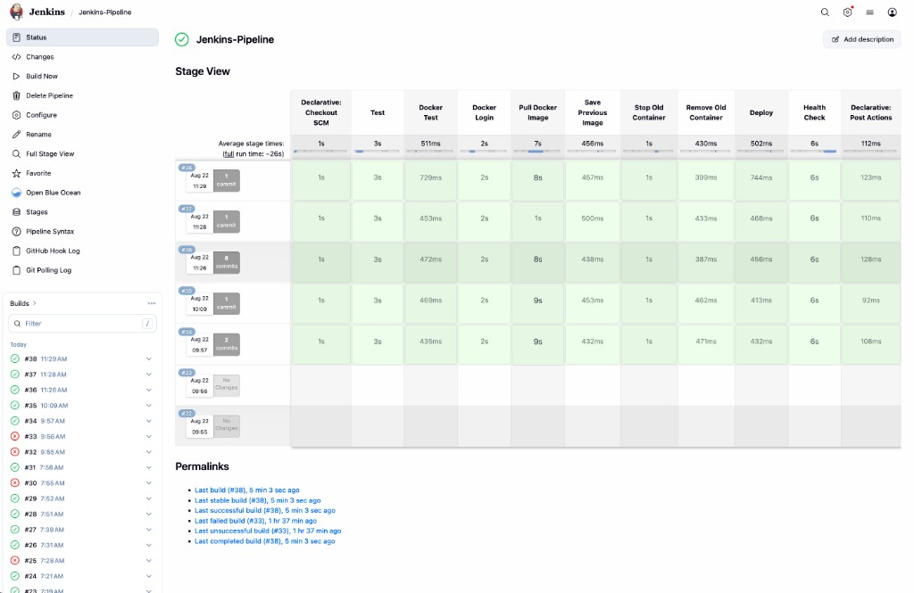

# DevOps CI/CD Platform

End-to-end delivery for a Node.js API: GitHub Actions builds and publishes the image, Jenkins deploys it locally with Docker, and a Next.js dashboard shows live status.



## Pipeline

```
GitHub push → GitHub Actions (test, build, push image)
            → Jenkins (pull image, deploy, health check)
            → Docker container on :3001
            → Dashboard (live status, logs, last build)
```

| Stage | What it does |
| --- | --- |
| Test | `npm ci` and Jest |
| Docker Hub | Publish `rutuja2005byte/devops-cicd-platform` |
| Deploy | Replace `devops-platform-cd` (`3001 → 3000`) |
| Health | `GET /health` must return `UP` |
| Rollback | Restore the previous image if deploy fails |

Jenkins is triggered by GitHub push when reachable, and by SCM polling for local Jenkins.

## Stack

Node.js, Express, Jest, Docker, Docker Compose, Nginx, GitHub Actions, Docker Hub, Jenkins, Next.js dashboard.

## Run locally

```bash
npm test
docker compose up --build
```

API: `http://localhost:3000` (or port 80 via Nginx)

CD container (Jenkins): `http://localhost:3001/health`

```bash
cd dashboard
npm install
npm run dev
```

Dashboard talks to Docker and Jenkins on this machine. Jenkins credentials belong in `dashboard/.env.local` only (`JENKINS_USER`, `JENKINS_API_TOKEN`). Do not commit that file.

## Layout

```
src/                 Express API
tests/               Jest
Dockerfile
docker-compose.yml
nginx/               Reverse proxy
.github/workflows/   CI and image publish
Jenkinsfile          CD, health check, rollback
dashboard/           Next.js monitoring UI
docs/screenshots/    Pipeline captures
```
